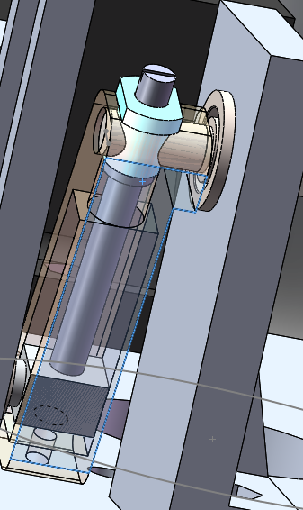
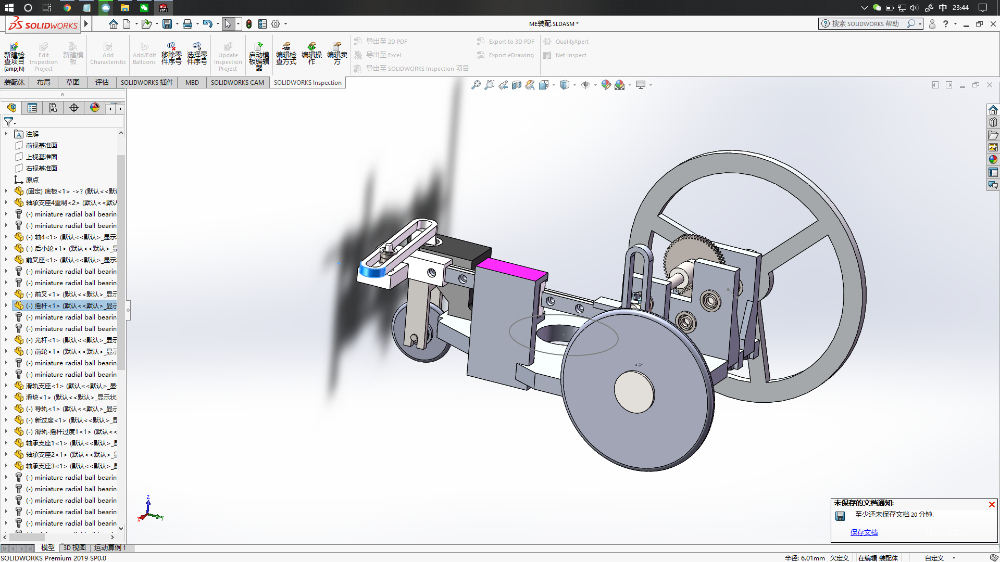
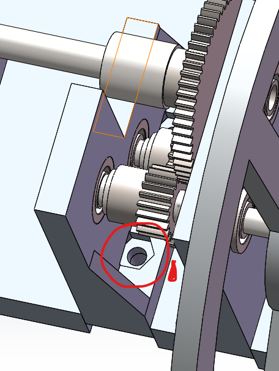
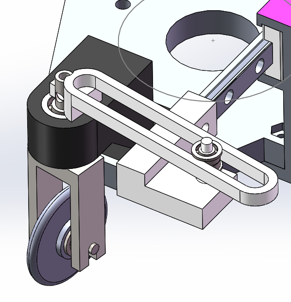
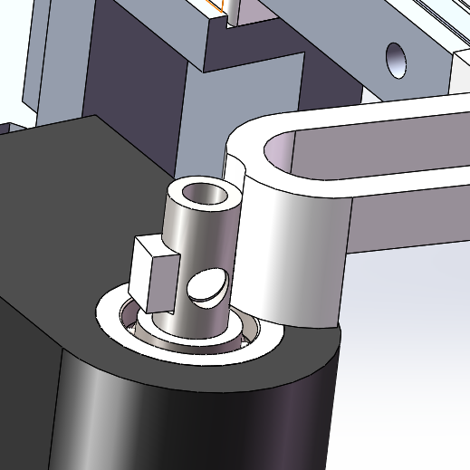
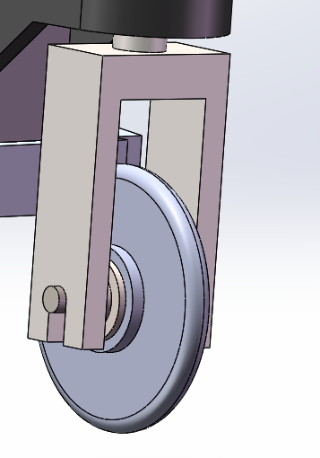
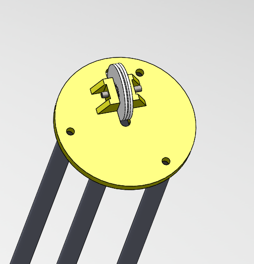
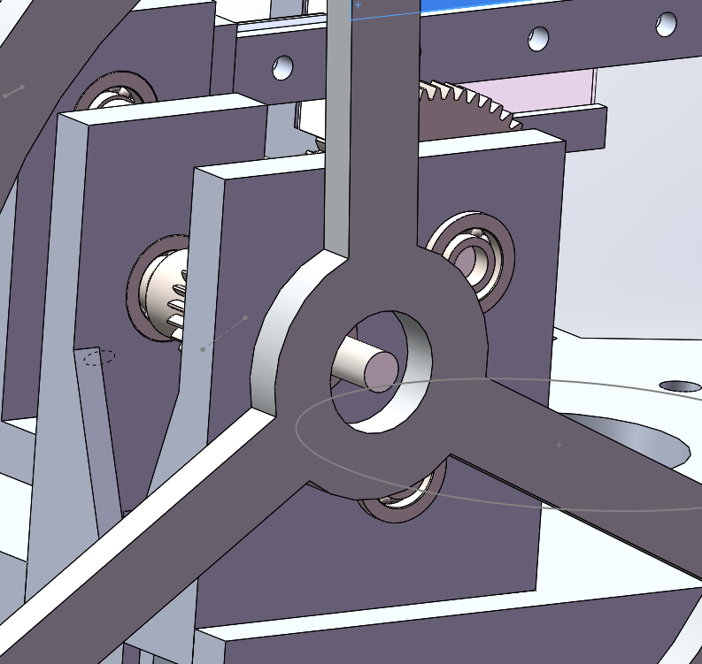
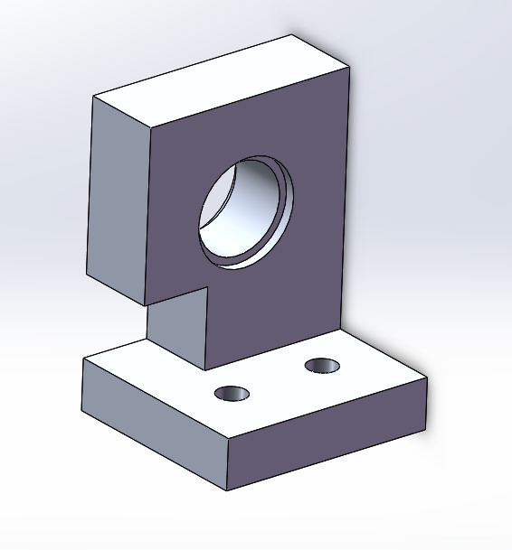

# 无碳小车图改

## 9月17日更新（version1.2)

1. 根据算法内参数对零件参数进行修改使更接近模拟值，改动涉及：
    - 前叉座的长度
2. 对顶部的修改
3. 修改底板为5mm

## 9月10日更新

1. 对**转向装置**的更改与补充具象化，改动涉及：
   - 转向1
   - 转向2
   - 转向3
   - 转向4
  

  
2. **重建装配体**

3. 对轴承支座4的错误更正于重制
### 仍然存在问题

- ~~底板过厚~~
- 顶与前叉的修改
- 齿轮侧螺钉固定问题

- 摇杆过渡的简化

- 前叉与摇杆的配合

- 前轮的固定

- 转向换为圆盘式，用法兰固定
- 定滑轮的优化

- 装配与加工潜在问题
	- 滑块如何固定
	- 右后轮怎么固定（法兰？）
	
	- 轴承支座4不便加工
	
<!--stackedit_data:
eyJoaXN0b3J5IjpbLTE3Njc2OTE2NzldfQ==
-->